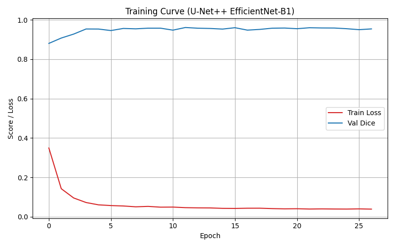

# Plant Disease Segmentation & Detection (U-Net++ + EfficientNet-B1)

## 1. Giới thiệu
Dự án xây dựng mô hình **phân đoạn và nhận dạng bệnh trên lá cây** sử dụng **U-Net++** với backbone **EfficientNet-B1**.  
Mục tiêu: xác định vùng lá bị bệnh và loại bệnh trên hình ảnh thật, hỗ trợ phát hiện sớm và giám sát bệnh cây tự động.

---

## 2. Kiến trúc mô hình
- **Base model:** U-Net++  
- **Encoder:** EfficientNet-B1 (thư viện `timm`)  
- **Optimizer:** AdamW  
- **Loss:** Dice + CrossEntropy  
- **Metric:** Dice Score  
- **Input size:** 512×512  
- **Số lớp:** 6 (gồm nền và 5 loại lá/bệnh)

---

## 3. Cấu trúc dữ liệu

| Bệnh (Class)            | Ảnh train | Ảnh val | Mask train | Mask val |
|--------------------------|------------|----------|-------------|-----------|
| Alternaria leaf spot     | 228        | 50       | 228         | 50        |
| Brown spot               | 168        | 38       | 168         | 38        |
| Gray spot                | 312        | 83       | 312         | 83        |
| Healthy leaf             | 324        | 85       | 324         | 85        |
| Rust                     | 276        | 68       | 276         | 68        |

Tổng cộng khoảng **1300 ảnh train/val**.

---

## 4. Bảng mã màu phân đoạn

| RGB (giá trị thật) | Class ID | Bệnh                     | Màu hiển thị (ước lượng)     |
| ------------------ | -------- | ------------------------ | ----------------------------- |
| (0, 0, 0)          | 0        | Background               | Đen                          |
| (128, 0, 0)        | 1        | Healthy                  | Đỏ đậm                       |
| (128, 128, 0)      | 2        | Alternaria leaf spot     | Vàng/oliu                    |
| (128, 0, 128)      | 3        | Brown spot               | Tím đậm                      |
| (0, 0, 128)        | 4        | Gray spot                | Xanh dương đậm               |
| (0, 128, 0)        | 5        | Rust                     | Xanh lá đậm                  |

---

## 5. Kết quả huấn luyện

- Train Loss giảm nhanh và ổn định  
- Validation Dice đạt ~0.95 → mô hình phân đoạn tốt trên tập kiểm thử

---

## 6. Chạy ứng dụng Streamlit

### Cài đặt môi trường
- pip install -r requirements.txt
- streamlit run app.py
## 7. Dữ liệu

Toàn bộ dataset được lưu trữ trên Hugging Face.
Truy cập tại: https://huggingface.co/datasets/your-dataset-link

## 8. Mô hình huấn luyện

File mô hình: best_unetpp_effb1.pth (≈ 35 MB)
Sử dụng để inference trực tiếp trong ứng dụng Streamlit.

## 9. Tác giả

Duy Hao
Plant AI Project — 2025
GitHub: https://github.com/duyhao-coder

## 10. Giấy phép

MIT License © 2025 Duy Hao
